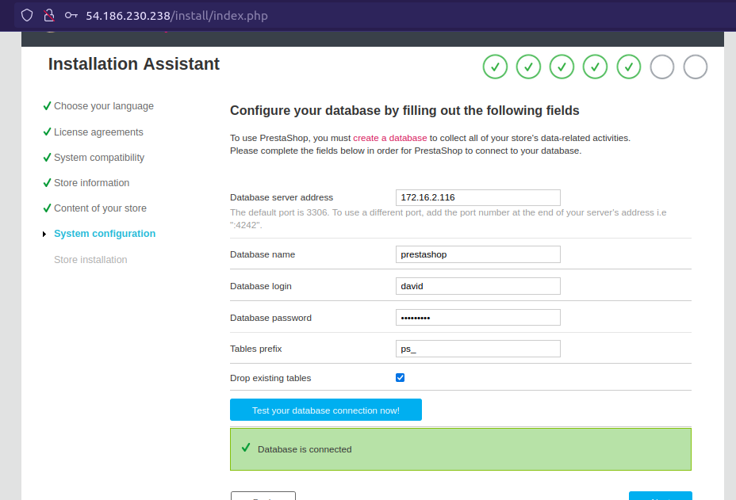

# Prestashop E-commerce Shop Deployment

PrestaShop is an Open Source e-commerce web application, committed to providing the best shopping cart experience for both merchants and customers. It is written in PHP, is highly customizable, supports all the major payment services, is translated in many languages and localized for many countries, has a fully responsive design (both front and back office), etc.

This documentation will walk you through automating the deployment of Prestashop to AWS Using Terraform and Ansible.

## Architecture Diagram:
<p align="center">
    
</p>

## Prerequisites:
In order to follow this tutorial, you should have the following installed on your development environment...
```
1. Terraform
2. Ansible
3. AWS cli
``````

## Steps for Deployment:
- Provision infrastructure
- Configure Database server
- Configure Application server
- Test the Application


### Step 1: Provision Application Infrastructure
The infrastructure was provisioned using Terraform. All the Terraform code can be found in the [./terraform](./terraform/) directory.

- First, cd into the /terraform directory
- Next create a key to access your servers by running ```ssh-keygen```
- Copy the public key of the key pair you just created
- Navigate to the [main.tf](./terraform/main.tf) in you terraform directory and paste key in the public key argument of the "aws_key_pair" resource block...
    ```sh
    resource "aws_key_pair" "bincom" {
    key_name   = "Bincom"
    public_key = "paste-key-here"
    }
   ```

- In the main.tf, uncomment the "aws_nat_gateway" block. Then goto [routes.tf](./terraform/routes.tf) and uncomment the NAT gateway route in the private route table. These will allow the Database server to gain access to the internet upon initial setup. After you have configured the database server, you can comment out these parts agai to save cost.

- At this point, you should be all set. You can now run ```terraform plan``` and then ```terraform apply```.

This should provision a vpc, 3 subnets, some security groups and route tables and 2 servers (web and database).


### Step 2: Configure the Database Server
- cd in to the [/ansible](./ansible/)  directory
- Open the [./ansible/host-inventory](./ansible/host-inventory) file and enter the public ip of your "web" server under ```[web]``` and the private ip of you mysql server under ```[mysql]```. (these can be gotten from the aws console). In the ```[mysql:vars]``` section, replace the ip address there with the public ip address of the web server.
- Open the [./ansible/ansible.cfg](./ansible/ansible.cfg) file and place the correct path to your private key.
- Test connection to the servers be running the following command:
    ```bash
    ansible --private-key <path-to-priv-key> -u ubuntu mysql -m ping
    ```
    ```
    # e.g
    ansible --private-key ~/.ssh/vagrant -u ubuntu mysql -m ping
    ```
- If ansible connect successfully to the server, it should give an output like this:
<p align="center">
    
</p>

- Next, navigate to [./ansible/vars/](./ansible/vars/) and create a "main.yaml". Copy the content of the "example_yaml.txt" into the "main.yaml" and adjust accordingly. These will hold the setting ansible will use to configure your databases and users, so adjust them carefully.

- When that's done, you can then go ahead to configure the server by running:
    ```sh
    ansible-playbook --private-key path_to_private_key -u ubuntu db.yaml
    ```

### Step 3: Configure Application Server
- While still in the ansible directory...
- Download the prestashop files:
    ```bash
    $ wget https://github.com/PrestaShop/PrestaShop/releases/download/8.1.2/prestashop_8.1.2.zip
    ```
- Unzip and delete the initial zip:
    ```
    $ unzip prestashop_8.1.2.zip && rm prestashop_8.1.2.zip
    ```
- Unzipping this file create 3 files, and you should move them to the "/ansible/files/site_files" folder.

- Next, ensure you can connect to the web server by running:
    ```bash
    ansible --private-key <path-to-priv-key> -u ubuntu web -m ping
    ```
- If it connects successfully, you can now proceed to configure the webserver. This will set up apache, php and all their dependencies as specified in the [./ansible/web.yaml](./ansible/web.yaml) script.


### Step 4: Test the Application
If your configuration goes through without a hitch, you should be able to access your application using the public IP address of your web server.

Visiting the page would start the installatio of the application and you'll be required to fill some forms. 

<p align="center">
    
</p>


Next, you will be asked to enter the details for connecting with the mysql server we created earlier.

- Ensure you enter the correct details and test connection before proceeding.

<p align="center">
    
</p>

### And Voila! It's all set up

Once again, Visit your public ip or domain name to view your application...

<p align="center">
    
</p>

Here's a screenshot of the servers in AWS...

<p align="center">
    
</p>


### Step 5: Clean Up

To ensure you don't rack up so much bills on the cloud, we will clean up everything we provisioned using Terraform.

- First cd into the terraform folder
- Run ```terraform destroy``` and follow the prompts

## Conclusion


## Attributions
- [Prestashop](https://github.com/PrestaShop/PrestaShop)
- [DigitalOcean](https://www.digitalocean.com/community/tutorials/how-to-install-linux-apache-mysql-php-lamp-stack-on-ubuntu-22-04#step-6-%E2%80%94-testing-database-connection-from-php-(optional))
- [Several9s](https://severalnines.com/blog/introduction-mysql-deployment-using-ansible-role/)
- [Strongdm](https://www.strongdm.com/blog/ssh-bastion-with-key)


